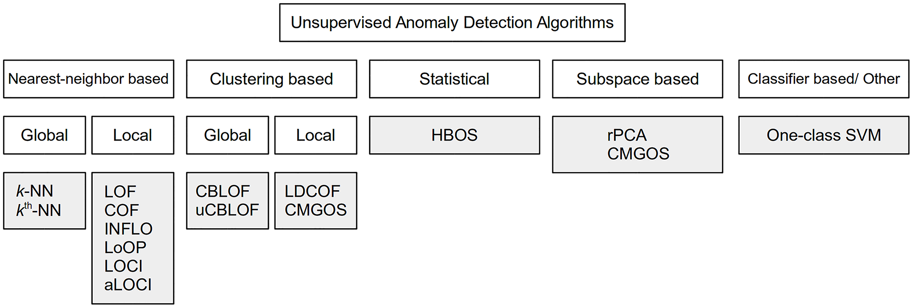

Unsupervised anomaly detection libs
===================================

Available algorithms:
- ~~kNN~~
- ~~kthNN~~
- ~~LOF~~
- ~~COF~~
- ~~INFLO~~
- ~~LoOP~~
- ~~LOCI~~
- ~~aLOCI~~
- ~~CBLOF~~
- ~~uCBLOF~~
- LDCOF
- ~~CMGOS~~
- ~~HBOS~~
- ~~rPCA~~
- ~~CMGOS~~
- ~~One-class SVM~~
- Autoencoder (NNet)

##### Requirements
- numpy
- scipy
- scikit-learn
- tensorflow
- keras

@author Iskandar Sitdikov
